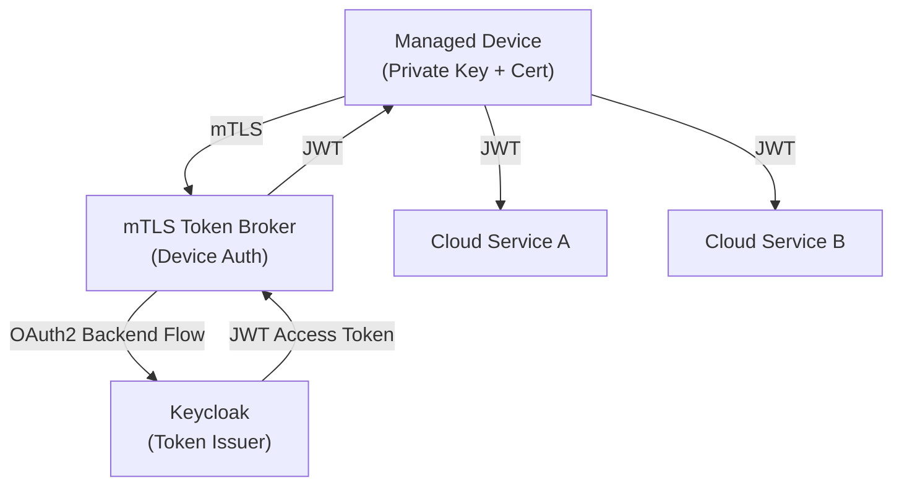
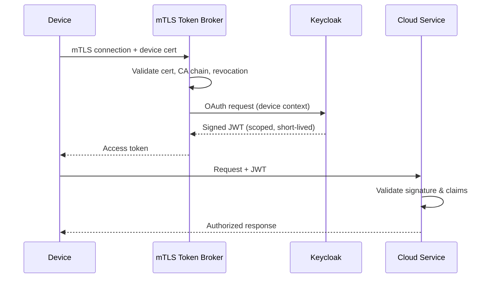
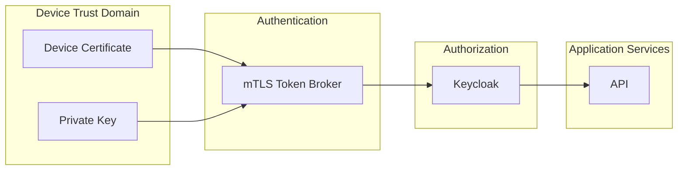
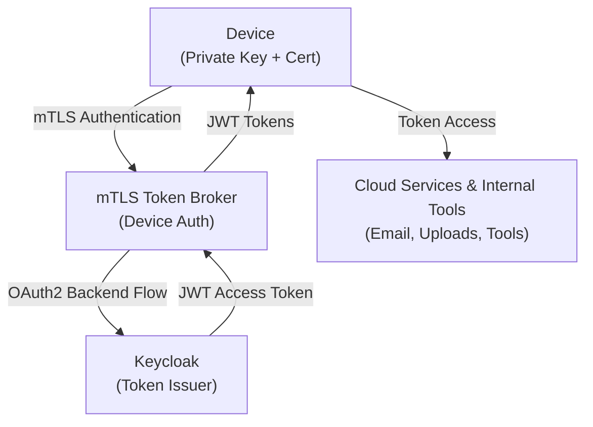
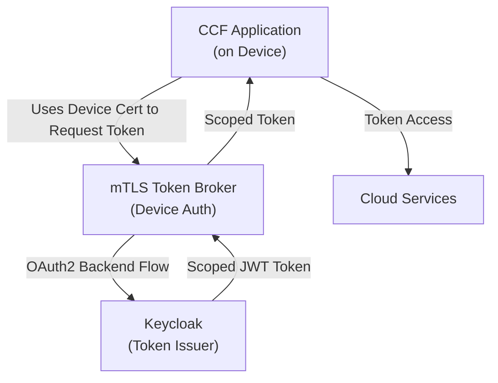
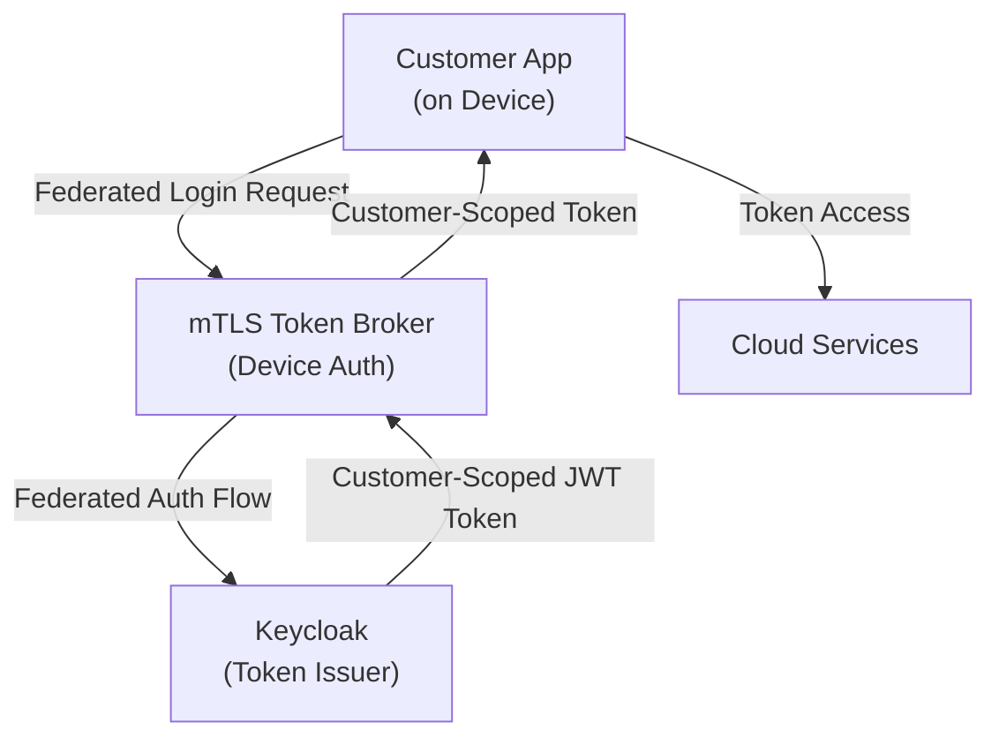

# Cloud-Based Token Brokering Using Existing Device Trust

## 1. Executive Summary

This proposal outlines a cloud-based token brokering system that leverages our existing device trust infrastructure (per-device private keys, public certificates, and trusted root CAs) to securely issue short-lived, scoped access tokens for cloud services.

By introducing a scalable mTLS authentication layer and integrating with a centralized identity provider (Keycloak), this design enables modern, standards-based authentication and authorization while preserving our current PKI investment.

Key benefits include improved security posture, better scalability, centralized policy enforcement, and reduced complexity for downstream services.

---

## 2. Background and Current State

Each managed device currently possesses:
- A unique private key
- A public device certificate
- A trusted root certificate authority chain

This provides strong cryptographic device identity. However, device trust today is tightly coupled to individual services, limiting scalability and making it difficult to adopt cloud-native authorization patterns and federated identity models.

---

## 3. Problem Statement

As cloud adoption increases, we require a standardized and scalable mechanism to:

- Authenticate devices without embedding long-lived credentials
- Issue short-lived, auditable access tokens
- Centralize authorization and policy enforcement
- Support federated identity across cloud services and environments
- Decouple device authentication from application authorization logic

---

## 4. Proposed Solution Overview

The proposed solution introduces two core components:

### 4.1 mTLS Token Broker (Device Authentication Layer)

A horizontally scalable service responsible for:

- Terminating mTLS connections from devices
- Validating device certificates and trust chains
- Performing revocation and policy checks
- Mapping device certificates to logical device identities and attributes
- Acting as a trusted client to the identity provider

This component is designed to be stateless, autoscalable, and isolated from application services.

---

### 4.2 Keycloak Identity Provider (Authorization Layer)

Keycloak will serve as the centralized identity and token service, responsible for:

- Issuing OAuth 2.0 / OpenID Connect (OIDC) tokens (JWTs)
- Defining token lifetimes, scopes, and claims
- Enforcing role- and attribute-based access control
- Supporting identity federation and future SSO use cases
- Centralizing authorization logic outside application code

The mTLS broker exchanges authenticated device context for short-lived access tokens using trusted backend OAuth flows.

---

## 5. Authentication and Authorization Flow

1. A device establishes an mTLS connection to the token broker.
2. The broker validates the device certificate chain and trust status.
3. Device identity and attributes are derived from certificate metadata and internal mappings.
4. The broker requests a scoped, short-lived token from Keycloak.
5. The token is returned to the device.
6. The device presents the token to cloud services.
7. Services validate the token signature and claims without performing certificate validation.

---

## 6. Security Benefits

- Strong cryptographic device authentication via mTLS
- No long-lived secrets stored on devices
- Short-lived, revocable access tokens
- Centralized policy enforcement and auditing
- Reduced blast radius in the event of compromise
- Clear separation of authentication (mTLS) and authorization (OAuth)

---

## 7. Scalability and Reliability

- Token broker is stateless and horizontally scalable
- Keycloak supports clustering and high availability
- JWT validation is performed locally by services
- Reduced authentication overhead for downstream systems

---

## 8. Operational Benefits

- Reuse of existing PKI infrastructure
- Reduced custom security logic in services
- Standards-based protocols improve maintainability
- Simplified onboarding for new services and environments
- Clear credential lifecycle management:
  - Long-lived certificates
  - Short-lived access tokens

---

## 9. Future Extensions

This architecture enables future enhancements, including:

- Cloud workload identity federation (AWS, Azure, GCP)
- Fine-grained, per-service or per-environment authorization scopes
- Device posture or attestation-based authorization
- Gradual migration away from direct certificate-based service authentication
- Integration with external identity providers if required

---

## 10. Risks and Mitigations

| Risk | Mitigation |
|------|------------|
| Token broker as critical path | Deploy with high availability and autoscaling |
| Certificate revocation complexity | Integrate OCSP and/or CRL checks |
| Token misuse | Short token lifetimes, audience restrictions |
| Operational overhead | Infrastructure-as-Code and managed deployments |

---

## 11. Conclusion

This proposal modernizes device authentication while fully leveraging existing trust infrastructure. By combining mTLS-based device authentication with centralized token brokering and Keycloak-based identity management, the organization gains a secure, scalable, and future-proof foundation for cloud access and federated authorization.

---

---

## How This Helps Us

This architecture provides clear benefits across three key use cases:

### 1. Centralized Device Authentication

- All device authentication flows (email, cloud uploads, internal tools) go through the **mTLS Token Broker**.
- Eliminates per-service credential management on devices.
- Enables unified audit logging and centralized policy enforcement.

### 2. App-Level Delegation for CCF Applications

- Applications on devices (e.g., CCF apps) can request scoped tokens using **device certificates** instead of embedding secrets.
- Reduces risk of secret leakage and simplifies onboarding of apps.
- Access control is delegated to Keycloak, keeping apps lightweight and secure.

### 3. Federated Credentials for Customer Apps

- Customers can run their internal apps on our devices without sharing their credentials with the device.
- The token broker and Keycloak handle **federated authentication**, issuing tokens scoped to the customer’s identity and permissions.
- Ensures separation of trust: our device never sees the user’s raw credentials.

### Use Case Flow Diagrams

#### 1. Centralized Device Authentication Flow

#### 2. App-Level Delegation for CCF Applications

#### 3. Federated Credentials for Customer Apps

