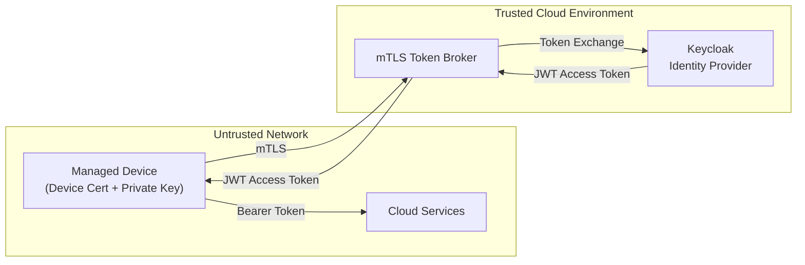

---

## 12. Threat Model

This section describes the primary trust boundaries, assets, and threats associated with the proposed token brokering architecture, along with corresponding mitigations.

### 12.1 High-Level Threat Model Diagram

